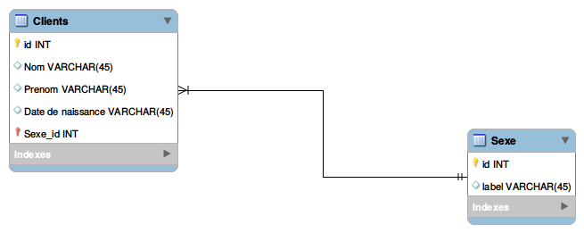

# SQL 10

Cet exercice est à réaliser en autonomie, le silence sera demandé dans la salle pour la concentration de tous. L'exercice durera 2h.

Le but est d'apprendre et d'utiliser une modélisation de base de données.

Vous devez modéliser une base de données pour les apprenants de la Code Académie de façon à ce que celle-ci puisse être utilisée dans l'optique d'une insertion profesionnelle (spécialité, nv de diplôme etc...). Une réflexion sera donc apportée sur les données présentes sur cette table, avant même l'étape de modélisation.
Une fois vos tables et les champs définis, il vous sera demandé de définir les cardinalités entre celles-ci. 

Le rendu attendu sera un schéma de ce type : 

Vous êtes libres d'utiliser n'importe quel type de support pour le rendu de cette modélisation (papier/crayon, logiciel de dessins, MYSQL workbench). La définition du type de données ainsi que les contraintes NE SONT PAS ATTENDUES. L'intégration de cette modélisation n'est pas attendue non plus. 

Inutile de regarder sur le voisin, il y a peu de chances que vous fassiez les mêmes choix. Cette modélisation devra être la plus aboutie et travaillée possible à la fin du temps imparti. 
